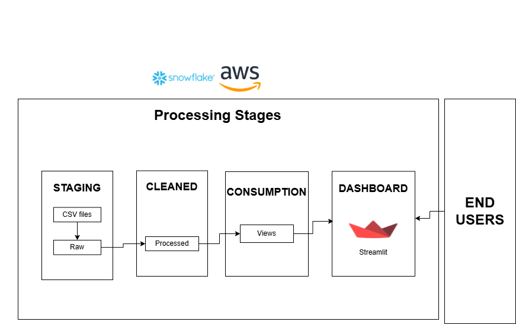

# Food Aggregator Data Pipeline 🍽️🚀

## Overview

This project implements a **scalable ELT pipeline** using **Snowflake, dbt, and Dagster**, enabling efficient data ingestion, transformation, and real-time analytics. The pipeline processes structured data, applies incremental transformations, and visualizes insights using **Streamlit**.

## Architecture

### **Key Components**

1. **Ingestion Layer** 📥

   - Raw data (CSV) is loaded into Snowflake.
   - Uses **COPY INTO** for batch ingestion.

2. **Transformation Layer** 🔄

   - dbt applies transformations to convert raw data into **structured tables**.
   - Implements **incremental models** to process only new/changed records, reducing query costs by **80%**.

3. **Consumption Layer** 🏗️

   - Data is stored as **views in Snowflake**, optimized for analytics.
   - Ensures **faster query performance** for dashboards.

4. **Orchestration with Dagster** ⚙️

   - Automates pipeline execution & scheduling.
   - Manages dependencies between ingestion, transformation, and analytics.

5. **Analytics & Visualization** 📊
   - Processed data is visualized in **Streamlit** dashboards.
   - Provides **real-time and hourly trend analysis** for insights.

---

## 🛠️ Technologies Used

- **Snowflake** – Cloud data warehouse for storing raw & processed data.
- **dbt (Data Build Tool)** – Handles **incremental transformations** in Snowflake.
- **Dagster** – Orchestrates ELT workflows, ensuring automation & scheduling.
- **Streamlit** – Builds interactive dashboards for real-time analytics.
- **AWS** – Cloud infrastructure for hosting & data storage.

---

## 📌 Features

✅ **End-to-End Automation** – Fully managed ELT pipeline with automated workflows.  
✅ **Incremental Data Processing** – dbt processes only **delta data**, reducing costs.  
✅ **Scalable Architecture** – Can handle **large datasets** with Snowflake.  
✅ **Real-Time Analytics** – Live dashboards powered by **Streamlit & Snowflake Views**.

---
